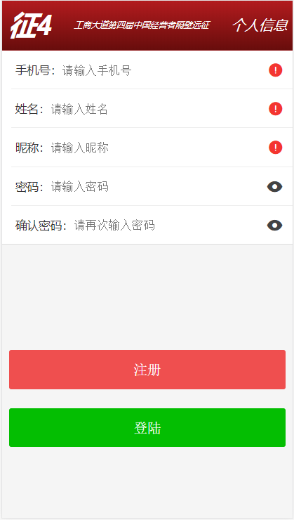
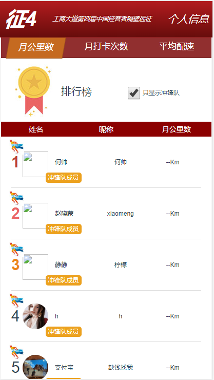
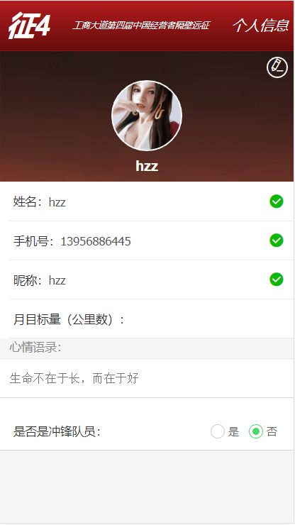

# z4  打卡项目

> A Vue.js project

## Build Setup

``` bash
# install dependencies
npm install

# serve with hot reload at localhost:8080
npm run dev

# build for production with minification
npm run build

# build for production and view the bundle analyzer report
npm run build --report

# run unit tests
npm run unit

# run e2e tests
npm run e2e

# run all tests
npm test
```

For a detailed explanation on how things work, check out the [guide](http://vuejs-templates.github.io/webpack/) and [docs for vue-loader](http://vuejs.github.io/vue-loader).


#### 前端使用的是vue +ElementUI +ydui

### 技术栈
##### ydui 
##### vue-upload-component
##### echarts
##### vue-router
##### axios


##### 登陆/登陆成功页面
<br>
<p>
  
  
</p>
##### 注册页面
<br>
<p>
	
</p>

##### 首页
<br>
<p>
	
</p>

##### 排名/打卡页面
<br>
<p>
	
 	
</p>

##### 个人信息/个人信息修改
<br>
<p>
	
 	
</p>

<br>
<strong>......</strong>
<br>


